## Index

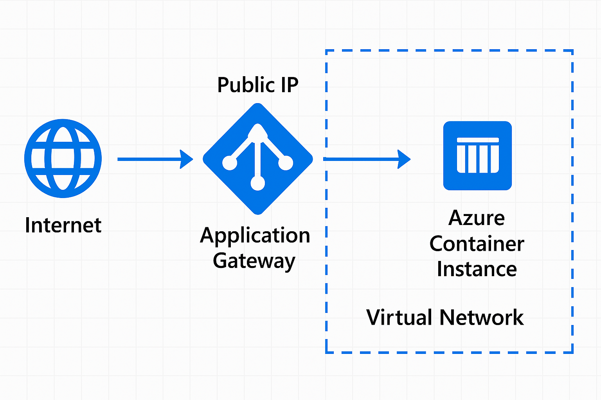


## Resources 
1. - [Create rg](#create-rg)
2. - [Create dns zone](#create-dns-zone)
3. - [Create acr](#create-acr)
4. - [Login in acr](#login-in-acr)
5. - [Push the image](#push-the-image)
6. - [Create virtual network and subnets](#create-virtual-network-and-subnets)
7. - [Create the container instance](#create-the-container-intance)
8. - [Create an static public ip address](#create-an-static-public-ip-address)
9. - [Create gateaway](#create-gateaway)
10. - [Create recordset](#create-recordset)


## Create rg
- [Index](#index)

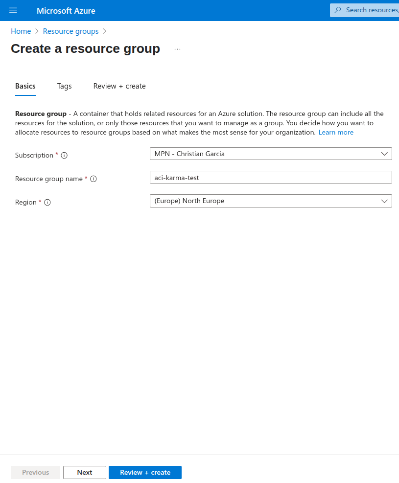

## Create dns zone
- [Index](#index)

1. Copy the four dns

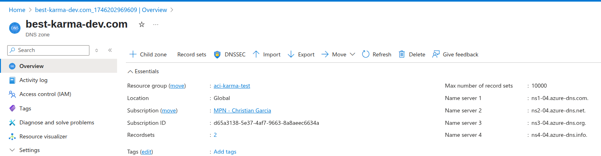

2. And paste in squarezone dns

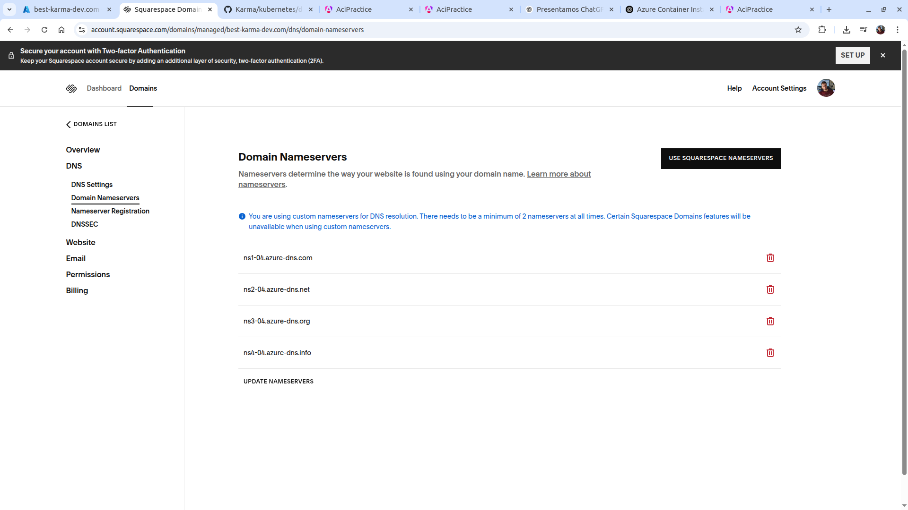


## Create acr
- [Index](#index)

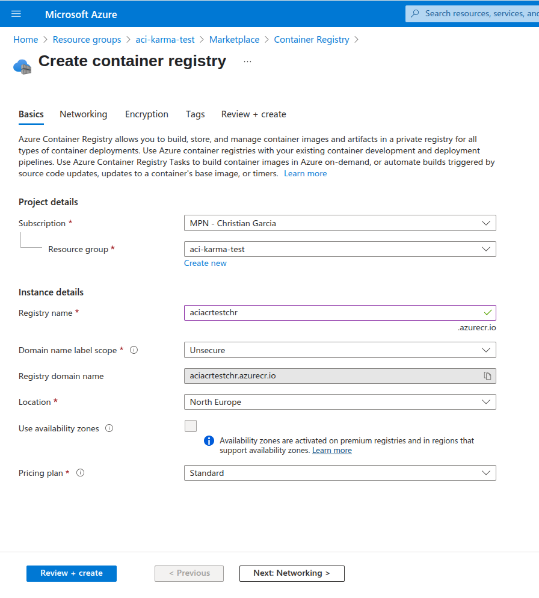


## Login in acr
- [Index](#index)

enable user and login in acr

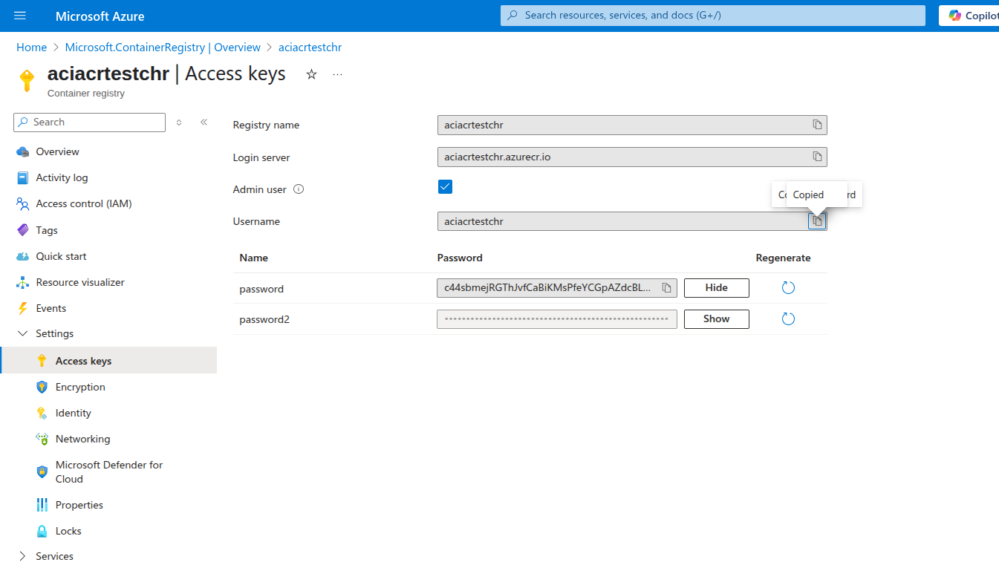

```
docker login <nombre-del-registro>.azurecr.io -u <usuario> -p <contraseña>
```

## Push the image
- [Index](#index)

```
docker push aciacrtestchr.azurecr.io/aci-web:0.0.1
```

## Create virtual network and subnets
- [Index](#index)

1. Create Virtual network with default options

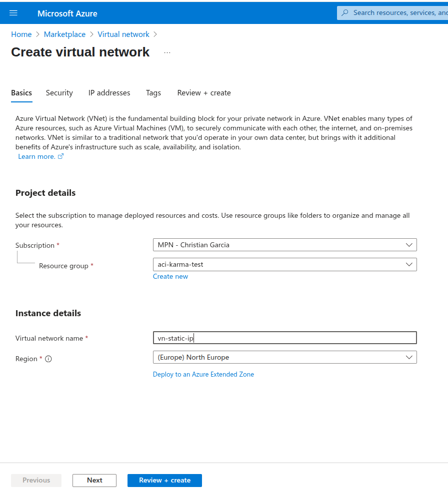

2. Create subnet in virtual network one for container and one for gateaway with default options

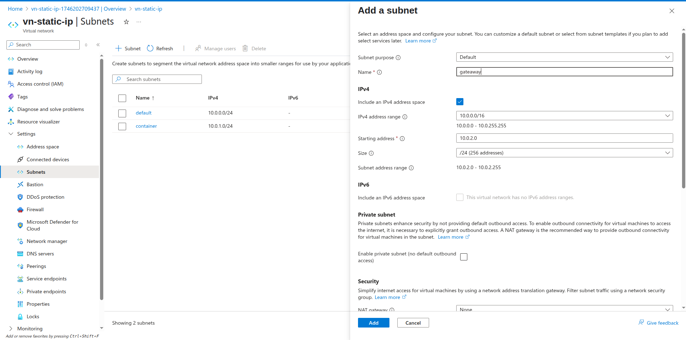

## Create the container instance
- [Index](#index)

1. Select the container registry

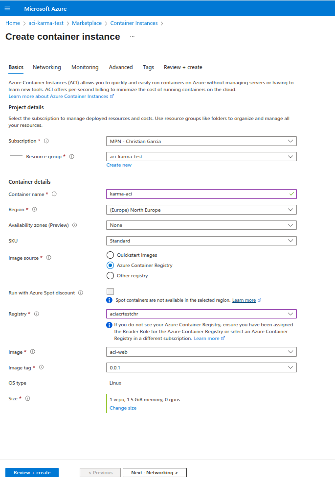

2. Select private ip , the virtual network we just created and the container subnet finally add the expose port in my case 4200

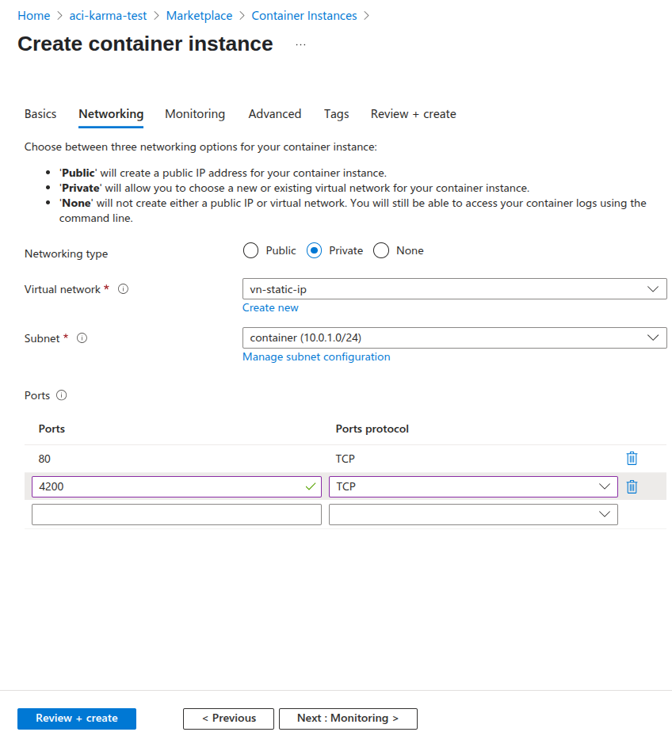

## Create an static public ip address
- [Index](#index)

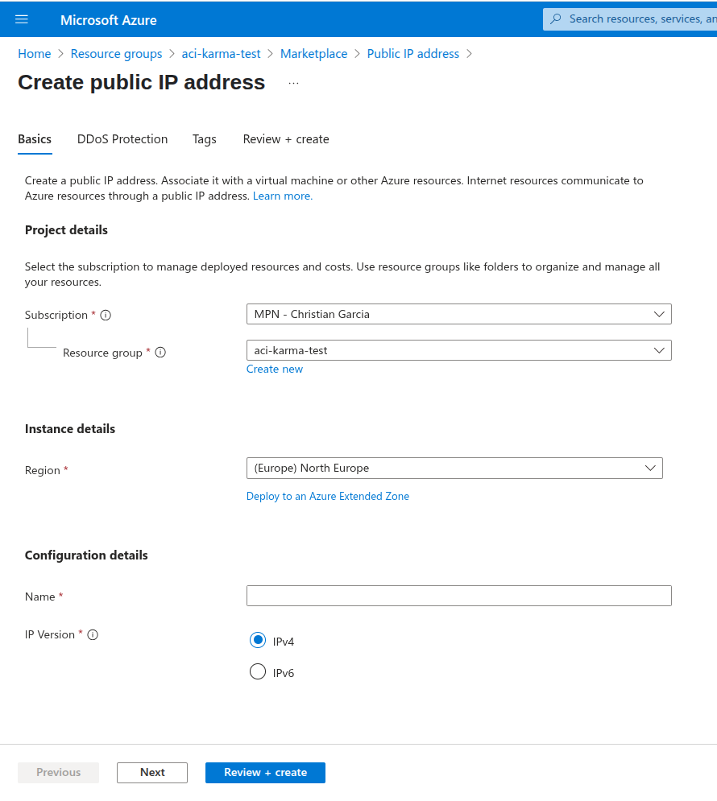

## Create gateaway
- [Index](#index)

Once we have the public ip address and the virtual network is time to join both together:

1. Create application gateaway, set it to standard v2 , the virtual network and the subnet of the gateway

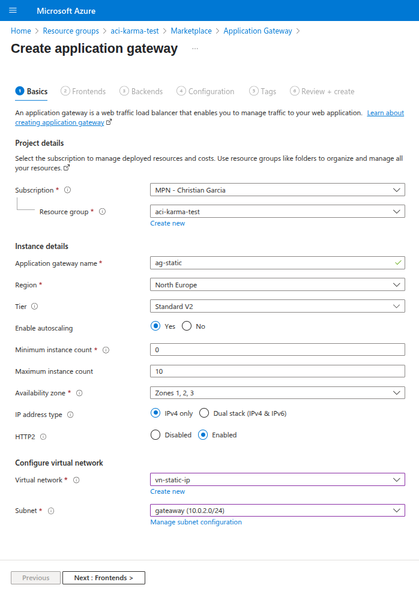

2. Set the frontend

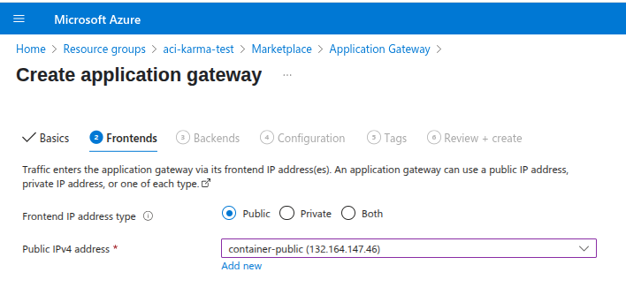

3. Add a new backend pool , ( target is the container instance private ip )

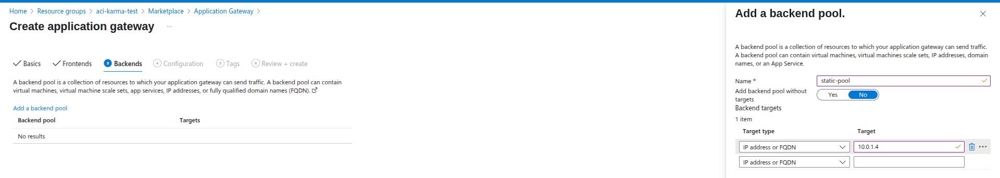

4. Finally we have front-end and back-end both with their rules , now we need join together with a routing rule,
   set Listener

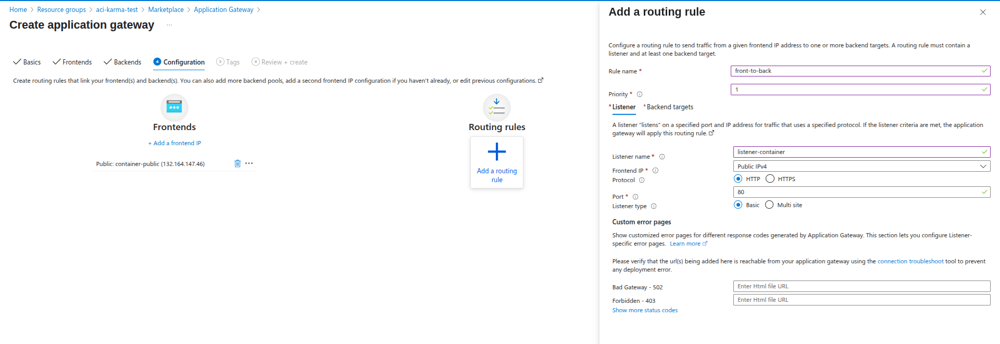

5. Set backendTarget , setting the port application is running inside container in my case 4200

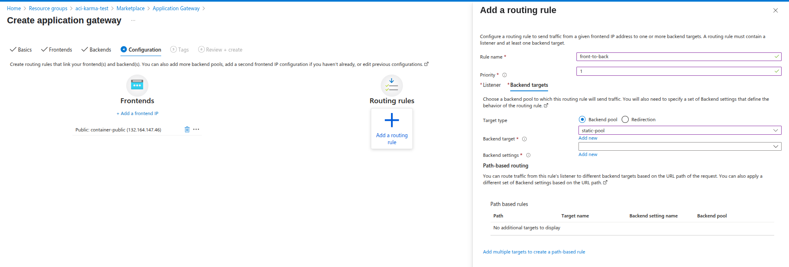

6. Add new backend setting with the port application is running inside container in my case 4200

7. Review and create

## Create recordset
- [Index](#index)

Now we can Create a recordSet for our domain , in my case best-karma-dev.com

1. go to dns zone -> recordset -> add ( the public ip is the public ip of the application gateway )

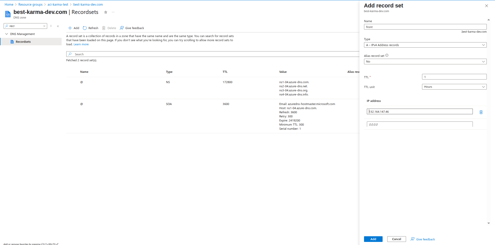

2. wait a bit and visit your site

